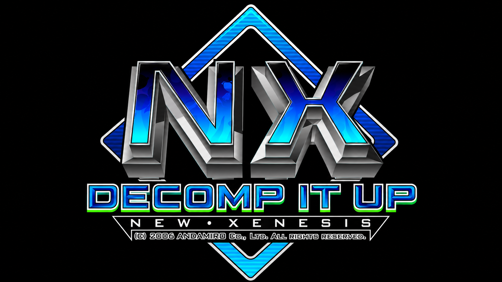

# NXReconstructed (Decomp-it-up-New-Xenesis)

A faithful C reconstruction of **Pump It Up NX (New Xenesis)**, based on the Linux arcade
executable `piu` (ELF i386).

This project reverse-engineers the original binary and reproduces its gameplay, rendering, audio,
and state machine as closely as possible — no emulation, no wrappers. Native executable for
Windows and Linux, built with SDL2 + OpenGL.

It continues the series **PumpyReconstructed** (PREX 3) → **ExceedReconstructed** →
**Exceed2Reconstructed** → **ZeroReconstructed**. Screens from earlier versions that were replaced
by their NX counterparts are kept in the tree, disabled (commented out or left out of the build).
See [docs/ZERO_PARA_NX.md](docs/ZERO_PARA_NX.md) for the Zero → NX differences.

Releases: <https://github.com/bmbelo87/decomp-it-up-New-Xenesis/releases>

## Status

| Feature                                                          | Status |
| ---------------------------------------------------------------- | ------ |
| Asset decryption: RESPAC2 (`.DAT`), MOV3 (`.MOV`), `.SEE` steps (STEE + Blowfish) | ✅ |
| Song table: 193 songs from `piu` (`0x0813c200`)                  | ✅      |
| Station Select (CStation): TRAINING / ARCADE / WORLD TOUR / SPECIAL ZONE | ✅ |
| Default station from the Service Menu (EEPROM `+0xECA`)          | ✅      |
| Song select (CSelect): carousel, channels, preview, 1P/2P difficulties | ✅ |
| Song title / artist / BPM scrolling under the disc (`MICROGBE.TTF`) | ✅   |
| Modifier codes with `COMMAND.DAT` icons                          | ✅      |
| SPECIAL ZONE: channels by heart cost, hearts, extra stage        | ✅      |
| WORLD TOUR (CSelectWorld): map, regions, missions, commands, conditions | ✅ |
| WORLD TOUR: mission objective, items, Continue, WorldGrade, Mission Clear, unlocks | ✅ |
| WORLD TOUR: records and names per location (`SETTINGS/RANK.DAT`) | ✅      |
| TRAINING Station (CSelectEz): lessons / parts, lesson text, codes | ✅     |
| Gameplay: skins from `BGA\SKINxx.DAT`, row judgment, long notes   | ✅      |
| Gameplay: NX Mode (3D track), X Mode, AC/DC, UA, Vanish, Flash, …  | ✅      |
| Song backgrounds: `BGA\%03X.MOV` → `BGA\%03X.DAT` → `BGA\001.MOV` | ✅     |
| Stage Break (life by Service Menu option, 51 misses), `STAGEBREAK.MOV/.AUD` | ✅ |
| kcal screen at the end of the credit (CSports, `SPORTS.DAT`)     | ✅      |
| Enter Your Name with the name-change animation (`NCHANGE.DAT`)   | ✅      |
| Service Menu with the NX options (`SCRIPT\SETUP_*.LUA`)          | ✅      |
| Settings saved in `SETTINGS/PIUNX.INI` (EEPROM image)            | ✅      |
| Mercy ticket / score per ticket / credit limit                   | ⚙️ Saved, not used by the game yet |
| Restriction page, Internet Ranking                               | ❌      |

## Song Select Controls

| Pad | Action |
| --- | ------ |
| DL / DR | Previous / next song (held: repeat with acceleration) |
| UL / UR | Difficulty / channel |
| C | First press: READY. Second press: start |

## Modifiers (Commands)

Entered on the song select (and on the TRAINING lesson select) with the pads of the player they
apply to (check `0x804d240`, table `0x8143ca0`, effects `0x807c050` in `piu`).

| Sequence | Effect |
| -------- | ------ |
| `UL UR UL UR C` | Speed: 2X → 3X → 4X → 8X → off |
| `UL UR UL UR UL UR UL UR C` | RV (random velocity) |
| `DR DL UR UL DR UR DL UL C` | EW (earthworm) |
| `UL UR DL DR C` | Vanish → Non-Step → off |
| `DL UL DR DL UR DR UL UR C` | FL (flash) |
| `UL DL UR DR DR UL UR DL C` | FD (freedom) |
| `DR DL UR UL DR DL UR UL C` | M (mirror) |
| `UL UR UL UR DL DR DL DR C` | RS (random step) |
| `DL DL DR DR UL UL UR UR C` | AC (acceleration) |
| `DR DR DL DL UR UR UL UL C` | DC (deceleration) |
| `UL UR C DL DR DR DL C UR UL C` | RG (grade reverse) |
| `DL UR DL UR DR UL DR UL C` | X Mode (both players) |
| `DL UL C DR UR DL UL C DR UR` | NX Mode (both players) |
| `DL C DL C DL C UR C` | UA (track rotated 180°, both players) |
| `DR DR DR DL DR UL UR DL UR` / `C` / `UL` | Skin 1 / 2 / 7 |
| `UL UR DL C DL DR DR UR UR` | Skin 6 |
| `DL DR DL DR DL DR` | Reset |

Extras of this port (not in `piu`): `UL UL UL DL DL DL DR UL DL` = SKIN00, and the NX2 skin codes
`UL UR DL C DL DR DR UR DL / DR / UL` = skins 3 / 5 / 4.

## Debug Console Extras

| Command | Effect |
| ------- | ------ |
| `/skin N` | Use `BGA\SKIN0N.DAT` from the next song on |
| F8 (during a song) | Autoplay on/off |
| F11 | Debug overlay |

## Project Structure

```
NXReconstructed/
├── src/
│   ├── main.c              # Entry point, state machine, game loop
│   ├── intro.c / logo.c    # Attract and title
│   ├── nx_station.c        # Station Select (CStation)
│   ├── nx_select.c         # Song select (CSelect), SPECIAL ZONE, modifier codes
│   ├── nx_text.c           # Song title / artist text (stb_truetype)
│   ├── nx_world.c          # WORLD TOUR (CSelectWorld) + nx_world_data.c (generated)
│   ├── nx_mission.c        # Mission / lesson objective, Continue, Mission Clear
│   ├── nx_training.c       # TRAINING (CSelectEz) + nx_training_data.c (generated)
│   ├── nx_sports.c         # kcal screen (CSports)
│   ├── nx_rank.c           # SETTINGS/RANK.DAT (CRankManager)
│   ├── nx_songs.c          # Song table generated from piu
│   ├── gameplay.c          # Input, row judgment, long notes, items, NX/X mode, rendering
│   ├── result.c            # Dance Grade, WorldGrade and stage progression
│   ├── step.c              # .STX / .SEE step loading
│   ├── service_menu.c      # Service Menu (SETUP)
│   ├── eeprom.c            # SETTINGS/PIUNX.INI (EEPROM image)
│   ├── movie.c             # MOV2/MOV3 playback (libmpeg2)
│   ├── resource.c / bga.c  # SPR/BGA/DAT/RESPAC2 loading, BGA3 scenes
│   └── ...                 # audio, input, render, texture, console, earlier games, etc.
├── include/                # Headers (pumpy.h = main game state, stb_truetype.h)
├── tools/
│   ├── zero_decrypt.py     # Extracts .AUD / .PNZ / .DAT / .MOV
│   ├── gen_nx_songs.py     # Song table generator (reads piu)
│   ├── gen_nx_world.py     # WORLD TOUR stages / missions / texts (reads piu)
│   ├── gen_nx_training.py  # TRAINING lessons / texts (reads piu)
│   ├── see_notes.py        # .SEE note histogram (Blowfish decode)
│   ├── piudis.py           # Disassembler helper for piu
│   └── lua50_dump.py       # Lua 5.0 bytecode dumper for SCRIPT\*.LUA
└── CMakeLists.txt
```

## Building (Windows and Linux)

Window, input and audio use **SDL2**, rendering is **OpenGL 1.1 + GLU**, and video uses
**libmpeg2**.

**Windows** (Visual Studio 2019+ with [vcpkg](https://vcpkg.io))

```powershell
vcpkg install sdl2:x64-windows-static zlib:x64-windows-static libmpeg2:x64-windows-static
cmake -S . -B build -A x64 -DCMAKE_TOOLCHAIN_FILE=<vcpkg>/scripts/buildsystems/vcpkg.cmake -DVCPKG_TARGET_TRIPLET=x64-windows-static
cmake --build build --target Pumpy --config Release
```

With a `*-windows-static` triplet the result is a single `Pumpy.exe` (static C runtime, no extra
DLLs). Use `-A Win32` with `x86-windows-static` for 32-bit.

**Linux**

```bash
sudo apt install cmake build-essential libsdl2-dev libgl-dev libglu1-mesa-dev zlib1g-dev libmpeg2-4-dev
cmake -S . -B build -DCMAKE_BUILD_TYPE=Release
cmake --build build --parallel
```

The CMake target is still named `Pumpy`. Place the executable in the NX data folder, next to
`AUDIO/`, `BGA/`, `SCRIPT/`, `SETTINGS/`, `TITLE/`, `WAVE/` and `STEP.DAT`. Assets are **not**
included — you must provide your own copy of the Pump It Up NX data files.

## Technical Notes

### Steps (`.SEE`)

- Magic `STEE`, 9 sections (one per mode) at `0xFC`. Each section header is the level plus
  **200** block counts (`0x324` bytes; `piu` loops up to `[0xa880dc4] = 0xC8`), then the blocks,
  each `u32 size + zlib`, decrypted with Blowfish (`0x8067e30`, 8 bytes every `0x18`).
- Each block has its own BPM, beats per measure, split, delay, speed (`+96`) and stop flag
  (`+100`); line time = `60000 / (split × BPM)` ms, blocks follow each other.
- Row notes: `0x01` tap, `0x0A..0x0C` long, `0x0D..0x10` fake / hidden, `0x14..0x28` mission
  items (`0x1F` = random item, replaced on load from the table at `0x810fa80`).

### Gameplay

- NX Mode: perspective camera (75°, track tilted 60°, scale 1.5); judgment and combo move to
  `y = 20 ± 110`. X Mode shifts notes sideways by the distance before the AC/DC curve.
- UA and the `dd` item share the same track state (`0x13`); the `ud` item restores it.
- Stage Break: life only counts when the Service Menu option is on and `stage + 1 ≥ option`;
  51 misses in a row always break (except WORLD TOUR); TRAINING and EVENT mode never break.

### Scoring, grade and kcal

- PERFECT +1000, GREAT +500 (each +1000 more with combo ≥ 4), GOOD +100, BAD −700, MISS −1000
- kcal per stage = `(0.475·level + 7.414 + m) · minutes · (steps − miss) / steps`, VO2 with
  `1.335·level + 19.829`; `m = 0.931` on CRAZY (`0x80735c9`).

## License

This project is for educational and research purposes only. It is not affiliated with or
endorsed by Andamiro Co., Ltd. All original game assets remain the property of their
respective owners.
